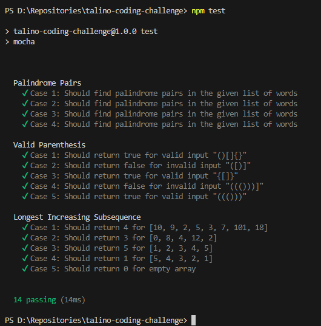

# talino-coding-challenge

This is a repository that will serve as my collection of answers for the coding challenges in the Talino Venture Labs coding examination.

## Getting Started

First, clone repository on your local device:

```bash
git clone https://github.com/villafrancaven/talino-coding-challenge.git
# or
git clone git@github.com:villafrancaven/talino-coding-challenge.git
```

Then, install all dependencies:

```bash
npm install
# or
yarn install
```

Then, you can run the test cases:

```bash
npm test
# or
npm test test/{testFileName}
```

## Sample test cases execution


